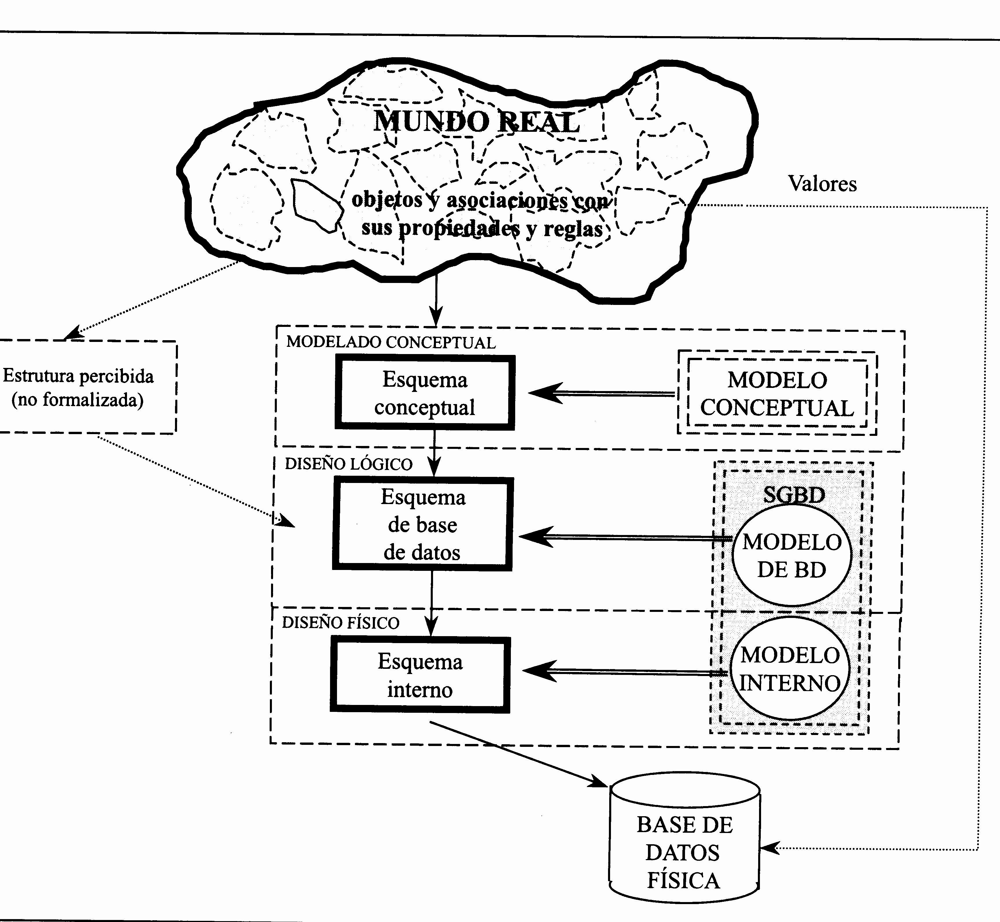
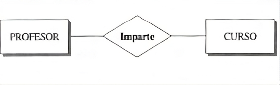
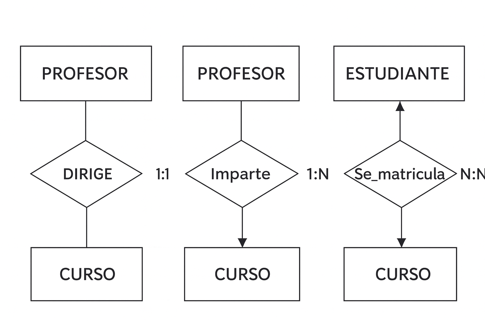
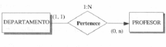
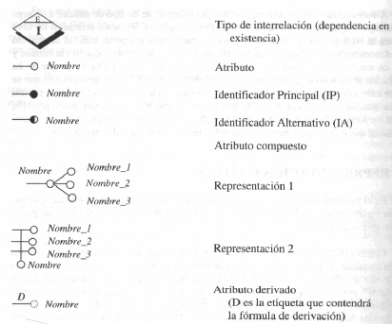

# Modelo entidad/interrelación.
## 1. Modelos de datos.

### 1.1 Introducción.

Una de las características fundamentales de los sistemas de bases de datos es que proporcionan cierto nivel de abstracción de datos, al ocultar las características sobre el almacenamiento físico que la mayoría de usuarios no necesita conocer. Los modelos de datos son el instrumento principal para ofrecer dicha abstracción.   

En una primera aproximación podemos decir que un modelo de datos es un conjunto de conceptos que permiten describir, a distintos niveles de abstracción, la estructura de una base de datos, a la cual denominaremos esquema.

Se pueden clasificar dependiendo de los tipos de conceptos que ofrecen para describir la estructura de la base de datos:  Los modelos de datos de alto nivel, o modelos conceptuales, disponen de conceptos muy cercanos al modo en que la mayoría de los usuarios percibe los datos, mientras que los modelos  datos de bajo nivel, o modelos físicos, proporcionan conceptos que describen los detalles de cómo se almacenan los datos en el ordenador
#### Definición de modelo de datos.

Conjunto de conceptos, reglas y convenciones que nos permiten describir y manipular los datos de un cierto mundo real que deseamos almacenar en una base de datos. Se trata de un conjunto de herramientas conceptuales para describir los datos, sus relaciones, su semántica y sus limitaciones.

#### Restricciones de integridad en los modelos de datos
En el mundo real existen ciertas reglas que deben cumplir los elementos en él existentes; por ejemplo la nota de un alumno en una asignatura no puede ser negativa. Cuando diseñamos una base de datos deseamos que ésta refleje lo mas fielmente posible el universo de discurso que estamos modelando. 

En nuestro sistema además de los datos, queremos describir las llamadas restricciones semánticas o de integridad, que pueden ser definidas como condiciones que limitan el conjunto de ocurrencias válidas de un esquema.

Son muchas las ventajas de tener integrada la descripción de las restricciones con los datos  en el  esquema de la base de datos, en lugar de ser aplicadas por los programadores:

- Semánticas.
- No se pueden producir inconsistencias.
- Baja carga de programación

### 1.2 Clasificación.
Según el nivel de abstracción de la arquitectura ANSI podemos clasificarlos en:

- **Modelos externos**, utilizados para la construcción de los  esquemas externos, que persiguen satisfacer las necesidades de los usuarios.

- **Modelos globales**, utilizados en la elaboración del esquema conceptual, buscan optimizar los recursos de información de la organización en su conjunto.

- **Modelos internos**, que sirven para construir el esquema físico o interno. 

De entre los distintos tipos de modelos, es en los globales en los que nos vamos a centrar. 
Los modelos globales  (corresponde a lo que, en la arquitectura ANSI, se conoce como nivel conceptual) los podemos clasificar en:

- **Modelos conceptuales**. (También en algunas clasificaciones modelos lógicos basados en objetos). Están enfocados a describir el mundo real con independencia de la máquina.    
         **A) Modelo e/r**: Se basa en una percepción de un mundo real que consiste en un conjunto de objetos básicos llamados entidades, y de las relaciones entre estos objetos. La distinción se logra asociando a cada entidad un conjunto de atributos que describen al objeto. La estructura general de una base de datos puede expresarse gráficamente por medio de un diagrama E-R que estudiaremos más adelante.
         **B)** Modelo binario.  
         **C)** Modelo semántica de datos.    
         **D)** Modelo infológico.
             
- **Modelos lógicos**, convencionales o en algunas clasificaciones modelos lógicos basados en registros. Están orientados a describir los datos a nivel lógico para el SGBD, por lo que sus conceptos son propios de cada SGDB.  
        **A) Modelo relacional.** Los datos y sus interrelaciones se representan por medio de una serie de tablas (relaciones), cada una de las cuales tiene varias columnas con nombres únicos.  
        **B)** Modelo de red.  
        **C)** Modelo jerárquico.  

A diferencia de los modelos de datos conceptuales, los modelos lógicos sirven para especificar tanto la estructura lógica general  de la base de datos como una descripción en un nivel más alto de la implementación. Sin embargo, no permiten especificar en forma clara las limitantes de los datos.

### 1.3 Modelos de datos en el diseño de bases de datos.
{width: "160px"; margin: 0 15px 15px 0;"}
En este enfoque nos movemos en tres mundos distintos: el de la realidad, el de las ideas y el de los datos.  

En el primero de estos dominios, el mundo real (al que también se llama Universo del Discurso), existen objetos y asociaciones entre ellos; ambos tienen propiedades y hay reglas que imponen ciertas limitaciones. Será necesario una abstracción de este mundo real por parte del diseñador de la bd que lo observa a fin de obtener un esquema conceptual, que será tanto más perfecto cuanto más se asemeje al mundo real que se está contemplando bajo la perspectiva de unos determinados objetivos (los que nos impone nuestro sistema de información en concreto); éste es el dominio de las ideas y de la información. En el modelo E-R, el acento se pone en este campo en el que aparecen entidades e interrelaciones con determinados atributos, así como restricciones semánticas.

## 2. Modelo entidad/iterrelación.
### 2.1 Introducción.
Los modelos de datos soportado por los SGBD no suelen ofrecer, dado su bajo nivel de abstracción, los mecanismos suficientes para captar la semántica del mundo real, por lo que surgen modelos conceptuales, más ricos semánticamente, que facilitan la labor del diseñador ayudándole en su comunicación con el usuario.

Con el objetivo conseguir un mayor nivel de abstracción en los procesos de modelado, surge el modelo **Entidad-Interrelación** propuesto por [Peter Chen](https://es.wikipedia.org/wiki/Peter_Chen){target=blank} a mediados de los años setenta para la representación conceptual de los problemas y como un medio para representar la visión de un sistema de forma global.  
El modelo Entidad-Interrelación está soportado en la representación de los datos como un diagrama mediante el uso de un conjunto de símbolos y la aplicación de un número reducido de reglas.  
El modelo Entidad/Interrelación es posiblemente el de más amplia aceptación y al que se les suele dar soporte en la mayoría de las herramientas CASE.  

Los objetivos que debe cumplir un esquema conceptual son los siguientes:

- Captar y almacenar el universo del discurso mediante una descripción rigurosa.

- Aislar la representación de la información de los requisitos de máquinas y exigencias de cada usuario particular.

- Independizar la definición de la información de los SGBD en concreto.

El modelo tiene básicamente dos tipos de propiedades:

- **Estáticas:** Describen la estructura del Universo del Discurso y apenas varían en el tiempo.

- **Dinámicas:** Describen el paso de un estado a otro del esquema conceptual. El modelo Entidad/Interrelación (ME/R) tal como fue propuesto por Chen, no consideraba la parte dinámica, definiendo únicamente la parte estructural y semántica, así como la forma de representación de los datos. 

### 2.2 Estática del modelo Entidad/Interrelación.
Los conceptos que definen la estática del modelo son los siguientes:
#### ENTIDADES.
Una entidad es algo definible, como una persona, rol, evento, lugar, cosa, concepto o suceso, real o abstracto, de interés para la empresa. Es aquel objeto acerca del cual queremos almacenar información en la base de datos.   
Llamaremos **tipo de entidad** a la estructura genérica o categoría y **ocurrencia de entidad** a cada una de las realizaciones concretas de ese tipo de entidad. Así en un universo del discurso centrado en el funcionamiento de una biblioteca, el tipo de entidad AUTOR se refiere a la estructura que nos describe las características de los autores como una abstracción, mientras que una ocurrencia de autor será cada uno de los autores en concreto, por ejemplo, C.J. Date.

La representación grafica de un tipo de entidad (fuerte) es un rectángulo etiquetado con el nombre del tipo de entidad.

Existen dos clases de entidades:

**Entidades fuertes:** Son entidades que existen por sí mismas en el sistema. No dependen de otra para su existencia.  
Se representan con un rectángulo con el nombre del tipo de entidad.  

**Entidades débiles:** Entidades cuya existencia depende de una entidad fuerte. Si desaparece una ocurrencia del tipo de entidad fuerte, desaparecerán también todas las ocurrencias de la entidad débil. Se representan con un rectángulo doble con el nombre del tipo de entidad.  

#### ATRIBUTOS.
Es cada una de las propiedades que describen a una entidad o interrelación. Toman los valores de uno o varios dominios.

La representación gráfica de un atributo consiste en cualificar con su nombre el arco que une el dominio con el tipo de entidad o de interrelación. Sin embargo, para simplificar la representación gráfica y siempre que coincida el nombre del dominio con el atributo, será suficiente con un círculo u óvalo con el nombre del atributo.  

**Tipos de atributos.**

- Los **atributos simples** no pueden simplificarse ni dividirse en otros atributos. Un código postal es un ejemplo de atributo simple.
- Los **atributos compuestos** se compilan a partir de otros atributos, que pueden ser simples o no. Una dirección es un atributo compuesto que contiene un número de calle, un nombre de calle, un código postal, una ciudad y otros datos identificativos.
- Los **atributos derivados** se calculan a partir de otros atributos. El valor de la nómina de un empleado se deriva de sus horas trabajadas, la duración del periodo de pago y su salario. 
- Los **atributo multivaluados** son aquello que pueden contener varios valores distintos para una misma instancia de una entidad.
  

#### DOMINIO.
Las distintas propiedades o características de un tipo de entidad o de interrelación toman valores para cada ocurrencia de éstas. El conjunto de posibles valores que puede tomar una cierta característica se denomina **dominio**. 
El dominio se representa con un círculo u óvalo etiquetado con su nombre.    

  

#### INTERRELACIONES.
Llamamos tipo de interrelación a la estructura genérica del conjunto de aociaciones o interrelaciones existentes entre dos o más tipos de entidad, mientras que la ocurrencia de una interrelación será la vinculación existente entre las ocurrencias concretas de cada uno de los tipos de entidad que intervienen en la interrelación. Así, el tipo de entidad PROFESOR se interrelaciona con el tipo de entidad CURSO mediante el tipo de interrelación IMPARTE.
Representamos el tipo de interrelación mediante un rombo etiquetado con el nombre de la interrelación, unido mediante arcos a los tipos de entidad que asocia.  

Ejemplo:

#### RESTRICCIONES.
El modelo E/R tiene como restricción inherente que **sólo permite establecer interrelaciones entre entidades**, no estando admitidas entre entidades e interrelaciones ni entre interrelaciones. También obliga el modelo a que todas las entidades tengan un identificador,  lo que asimismo podría considerarse una restricción inherente. El no tener apenas restricciones inherentes dota al modelo de una gran flexibilidad para la representación del mundo real.  

En cuanto a **restricciones de integridad**, únicamente consideramos las restricciones específicas, distinguiendo entre las restricciones sobre valores y las estructurales.  

Las **restricciones sobre valores** se establecen mediante la definición de dominio, la cual permite limitar los valores del dominio y,  por tanto, los de los atributos sobre él definidos, a los de un determinado tipo de datos, o restringirlos a los comprendidos en un rango, o bien declarar los valores posibles en el caso de que la definición se haga por extensión.  

Las **restricciones estructurales** se refieren tanto a atributos como a interrelaciones.  

Entre todos los atributos de un tipo de entidad han de existir uno o varios (simples y/o compuestos) que identifiquen unívocamente cada una de los ejemplares de ese tipo de entidad. Cada uno de estos conjuntos de atributos se denomina **Identificador Candidato (IC)**. Cuando un IC es compuesto el número de los atributos que lo componen debe ser mínimo, en el sentido de que la eliminación de cualquiera de ellos le haría perder su carácter identificador. Luego todo IC debe cumplir La condición de ser **unívoco y mínimo**. Entre los IC se elige uno como **Identificador Principal (IP)** y el resto serán **Identificadores Alternativos (IA).**   

El modelo ER permite también atributos **multivaluados y opcionales** (nulos o faltantes). En general un atributo toma para cada ejemplar de entidad, un único valor de cada dominio (o dominios) subyacente(s) (un libro tiene un único título, un único ISBN, etc., pero también existen atributos que pueden tomar más de un valor (un curso puede impartirse en más de un idioma, o un profesor puede tener más de un teléfono); estos atributos reciben el nombre de multivaluados frente a los univaluados que toman un solo valor. Por otro lado, puede obligarse a un atributo de un tipo de entidad a que tome, como mínimo, un valor del (o de los) dominio(s) subyacente(s) para cada ejemplar de entidad; es decir, el valor de ese atributo es obligatorio (no puede ser nulo) para todo ejemplar de la entidad. La prohibición de valores nulos para un atributo (no admitir la opcionalidad) y la de que un atributo pueda tomar más de un valor (no admitir que sea multivaluado) son restricciones específicas sobre la estructura de los atributos, al igual que la declaración de atributos identificadores.

En lugar de representar la existencia de restricción (univaluación u obligatoriedad de un atributo), lo que se representa con un símbolo especial (línea discontinua o punta de flecha) es la ausencia de restricción; la razón es que lo más habitual es que un atributo sea univaluado y obligatorio, por lo que son éstas las características que se toman por defecto y. por tanto, son la contrarias.  

### 2.3. Semántica de las interrelaciones.
El contenido semántico de las interrelaciones se ha completado con conceptos tales como las cardinalidades mínima y máxima, las dependencias en existencia y en identificación, y diversos mecanismos de abstracción, como la generalización y la agregación.  

Las interrelaciones se caracterizan por:  

- **Nombre:** Identificador de la interrelación.   
- **Grado:** Número de tipos de entidad que participan en un tipo de interrelación. Puede ser de grado 2 (binarias) cuando asocian dos tipos de entidad (entre ellas tenemos las reflexivas que asocian ocurrencias de un mismo tipo de entidad); de grado 3(ternarias) cuando asocian tres tipos de entidad; o en general de grado n.   
- **Tipo de correspondencia:** Número máximo de ocurrencias de un tipo que pueden intervenir por cada ocurrencia del tipo de entidad asociado en la interrelación. Pueden ser:
    - 1:1 Cuando en la interrelación solo interviene como máximo una ocurrencia de cada tipo.
    - 1:N Cuando para uno de los tipos de entidad puede haber un número indefinido (mayor que uno) de ocurrencias
    - N:M En este caso en la interrelación intervienen un número indefinido de ocurrencias de cada tipo de entidad.

La representación de los tipo de correspondencia se puede realizar con las etiquetas 1:1, 1:N, N:M sobre la realación. 

  

**Cardinalidades mínima y máxima.**  

Definimos las cardinalidades máximas y mínimas de los tipos de entidad participantes en un tipo de interrelación como el número máximo y mínimo de ocurrencias de un tipo de entidad que pueden estar interrelacionadas con una ocurrencia del otro, u otros tipos de entidad que participan en el tipo de interrelación. Su representación gráica es una etiqueta del tipo (0,1),(1,1),(0,N),(1,N)o (N,N), según corresponda, que se pone en el arco que une el correspondiente tipo de entidad con el rombo que representa la interrelación.  

  

**Dependencia en existencia y en identificación.**  

Los tipos de interrelación se clasifican, según el tipo de entidades que vinculan, en fuertes si asocian tipos de entidades fuertes y débiles si asocian un tipo de entidad débil con un tipo de entidad fuerte.  

Dentro de los tipos de interrelación débil podemos diferenciar entre:  

- **Dependencia por existencia:** Se dice que hay  dependencia por existencia cuando en una interrelación se asocia una entidad fuerte con una débil, de forma que las ocurrencias del tipo de entidad dependiente (tipo de entidad débil) no pueden existir sin la ocurrencia de la entidad fuerte de la que dependen. Si desaparece una ocurrencia de un tipo de entidad fuerte, todas las ocurrencias de la entidad débil que dependen en existencia de la misma desaparecen con ella.
  
 

- **Dependencia por identificación:** Hay una dependencia por identificación cuando, además de la dependencia por existencia, las ocurrencias del tipo de entidad débil no se pueden identificar sólo mediante sus propios atributos, y necesitan el atributo identificador principal de la entidad fuerte de la que dependen, para su identificación.
  
   

**Interrelaciones exclusivas**

Dos (o más) tipos de relación son exclusivos respecto de un tipo de entidad que participa en ambos, si cada instancia del tipo de entidad sólo puede participar en uno de los tipos de relación.

### 2.4 Generalización y herencia.

La generalización es el tipo de interrelación que existe entre un tipo de entidad y los tipos de entidad mas específicos que dependen de el. En el mundo real es muy habitual la descomposición de un tipo de entidad, creándose de esta forma una jerarquía de tipos de entidad donde se puede distinguir un supertipo del cual dependen varios subtipos. La abstracción correspondiente a este tipo de interrelación entre entidades se denomina ES_UN (“IS_A”, en ingles).
Una de las características más importantes de las jerarquías es la herencia, por la cual, los atributos de un supertipo son heredados por sus subtipos.
En la generalización, los atributos comunes a los subtipos (incluidos los identificadores) se asignan al supertipo, mientras que los atributos específicos se asocian al subtipo correspondiente. Del mismo modo, las interrelaciones que afectan a todos los subtipos se asocian al supertipo, dejándose para los subtipos las interrelaciones especificas en las que el correspondiente subtipo, pero solo el, participa.

En función de cómo se establece la pertenencia a  un supertipo o subtipos podemos clasificar las jerarquías en parciales o totales y con solapamiento o sin solapamiento.  
    
- **Parcial:** Existen ocurrencias de supertipo que no pertenecen a ningún subtipo.
- **Total.** Toda ocurrencia de supertipo pertenece a algún subtipo.
- **Solapadas.** Existen ocurrencias que pertenecen a varios subtipos.
- **Exclusivas.** Una ocurrencia en un subtipo no puede darse en otro subtipo.

### 2.5 Dinámica del modelo E/R
El modelo Entidad/Interrelación (ME/R) tal como fue propuesto por Chen,  no consideraba la parte dinámica, definiendo únicamente la parte estructural y semántica, así como la forma de representación de los datos. Posteriormente, otros autores, como POONEN (1978) y SHOSHANI (1980), completan el modelo proponiendo lenguajes de manipulación (CLEAR y CABLE) capaces de recuperar y actualizar de forma sencilla los datos almacenados en las estructuras.

---
### 2.6 Simbología del modelo E/R

---

---

---

---

### 2.7 Ejemplos.

**Ejemplo 1. Gestión biblioteca.**

Supongamos que se desea establecer un modelo conceptual para la gestión de una biblioteca. Se desean tener almacenados todos los libros que la componen. Para cada libro interesa conocer el ISBN, el título, el autor o autores, la editorial, el año de publicación y la materia. De cada autor se quiere conocer su nombre, apellidos y nacionalidad. Un autor podrá haber escrito varios libros, de la misma forma que en un libro pueden participar varios autores. De la editorial se desea conocer el nombre, la dirección, teléfono, y correo electrónico. A dicha biblioteca podrán estar suscritos varios usuarios. De ellos se quiere saber su DNI, número de socio, nombre, apellidos, dirección y teléfono. Por cuestiones directivas, se limita el número de ejemplares prestados a cada usuario a uno.

**Ejemplo 2. Municipios.**

Supongamos el siguiente universo del discurso sobre municipios, viviendas y personas. Cada persona sólo puede habitar en una vivienda y estar empadronada en un municipio, pero puede ser propietaria de varias viviendas. Nos interesa también conocer las personas que dependen del Cabeza de Familia (C.F.). Se indicarán los supuestos semánticos que se consideren oportunos para justificar todas las decisiones de diseño.

**Ejemplo 3. Carreteras.**

Se desea diseñar una base de datos que contenga la información relativa a las carreteras de un determinado país. Se pide realizar el diseño en el modelo E/R, sabiendo que:
  - En dicho país las carreteras se encuentran divididas en tramos.
  - Un tramo siempre pertenece a una única carretera y no puede cambiar de carretera.
  - Un tramo puede pasar por varios términos municipales, siendo un dato de interés el kilómetro del tramo por el que entra en dicho término municipal y el kilómetro por el que sale.
  - Existen una serie de áreas en las que se agrupan los tramos y cada uno de ellos no puede pertenecer a más de un área.

**Ejemplo 4. Mundial de fútbol.**

Realizar el esquema E/R para una base de datos en la que se desea almacenar la información relativa a algunos aspectos del campeonato mundial de fútbol considerando los siguientes supuestos:
    • Un jugador pertenece a un único equipo y no hay dos jugadores con el mismo nombre.
    • Un jugador puede jugar en varios puestos distintos, pero en un determinado partido sólo puede jugar en un puesto.
    • En cada partido intervienen tres colegiados: 2 jueces de línea y un árbitro.
    • Un colegiado puede realizar una función en un partido y otra distinta en otro partido.
    • Cada partido involucra a dos equipos.
    • Es obligatorio en todo momento que un jugador pertenezca a un equipo determinado y no podrá cambiar de equipo a lo largo del mundial.

**Ejemplo 5**
En nuestra protectora, "Patitas Felices", trabajamos con un flujo continuo de animales que llegan a nosotros principalmente por abandono, rescate o entrega voluntaria. Cada animal que ingresa pasa primero por un periodo de cuarentena y evaluación veterinaria donde registramos todos sus datos: especie, raza, edad aproximada, estado de salud, carácter y cualquier necesidad especial. Los veterinarios colaboradores les realizan un chequeo completo, ponen al día sus vacunas y los esterilizan antes de buscarles un hogar.  

Una vez que el animal está listo para la adopción, lo asignamos a una de nuestras estancias interiores o exteriores según sus características. Nuestros voluntarios se encargan de su cuidado diario: paseos, limpieza, alimentación y socialización. Mantenemos un registro detallado de cada interacción porque nos ayuda a conocer mejor sus necesidades y comportamiento, información crucial para encontrarles una familia compatible.  

El proceso de adopción lo iniciamos cuando recibimos solicitudes de personas interesadas. Les hacemos una entrevista para conocer su estilo de vida, experiencia previa y expectativas, y así poder recomendarles el animal más adecuado. Cuando se formaliza una adopción, hacemos un seguimiento durante los primeros meses para asegurarnos de que todo marcha bien y ofrecer apoyo si surge cualquier dificultad.  

Además, dependemos mucho de la solidaridad de la gente: recibimos donaciones económicas para cubrir gastos veterinarios y de mantenimiento, y también donaciones de alimento y material. Los voluntarios son el pilar de nuestro día a día, y coordinamos sus turnos y actividades a través de un sistema que intenta adaptarse a su disponibilidad y habilidades. Llevar todo este registro de manera ordenada es vital para nosotros.  
